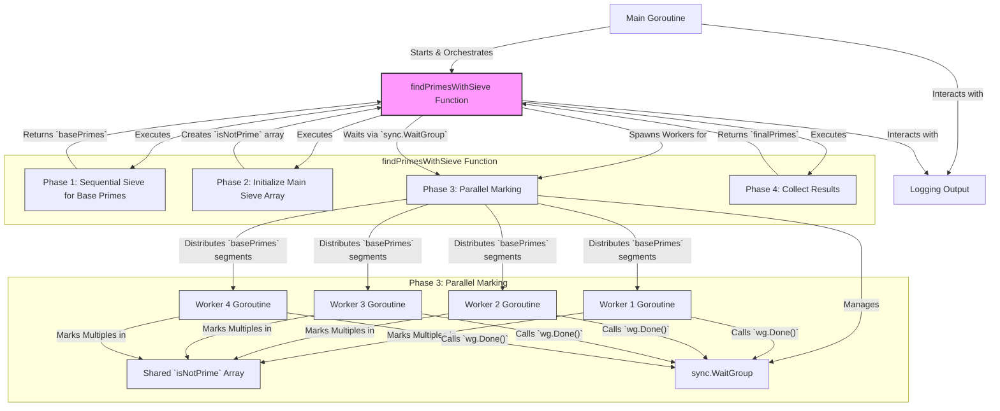
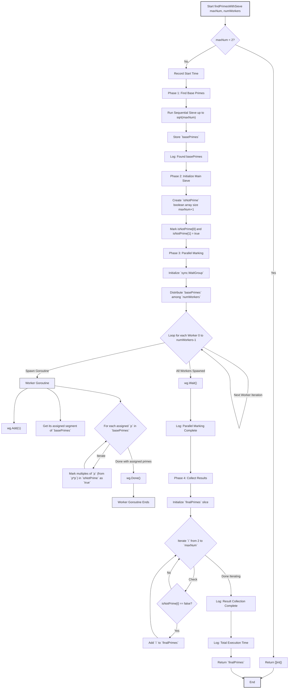

# Concurrent Prime Number Finder

\[**Test Coverage**\]: *86.8%*

A blazingly fast Go program that finds all prime numbers up to a specified limit (e.g., 200,000,000) using a parallelized Sieve of Eratosthenes algorithm. It leverages Goroutines for concurrent marking of composite numbers.

## Features

- Efficient prime number generation using a parallel Sieve of Eratosthenes.
- Uses a configurable number of worker Goroutines (e.g., 4) for the marking phase.
- Initial base primes (up to `sqrt(maxNum)`) are found using a fast sequential sieve.
- Simple progress logging for various stages of the sieve.
- Optimized for finding all primes in a large continuous range.

## Algorithm: Parallel Sieve of Eratosthenes

The program uses a parallelized version of the Sieve of Eratosthenes algorithm, which is highly efficient for finding all prime numbers up to a given limit `maxNum`. The process is divided into several phases:

1. **Phase 1: Base Prime Calculation (Sequential)**
    - A small, fast sequential Sieve of Eratosthenes is run to find all prime numbers up to `sqrt(maxNum)`. These are called `basePrimes`. This step is very quick because `sqrt(maxNum)` is significantly smaller than `maxNum`.
    - Example: If `maxNum` is 10,000,000, `sqrt(maxNum)` is ~3162. Finding primes up to 3162 is trivial.

2. **Phase 2: Sieve Initialization**
    - A boolean slice (e.g., `isNotPrime`) of size `maxNum + 1` is created. `isNotPrime[i] == true` will indicate that `i` is composite. Initially, all entries from 2 onwards are considered potentially prime (marked `false`). `isNotPrime[0]` and `isNotPrime[1]` are marked `true`.

3. **Phase 3: Parallel Marking of Multiples (Concurrent)**
    - This is the core concurrent part of the algorithm.
    - The list of `basePrimes` (found in Phase 1) is divided among the available worker Goroutines (e.g., 4 workers).
    - Each worker Goroutine is assigned a subset of these `basePrimes`.
    - For each `basePrime` `p` it is responsible for, the worker iterates through multiples of `p` (starting from `p*p`) up to `maxNum` and marks them as composite (e.g., `isNotPrime[multiple] = true`) in the shared `isNotPrime` slice.
    - Writes to the `isNotPrime` slice are inherently safe in this context because:
        - We are only ever setting a `false` to `true`.
        - Setting it to `true` multiple times (if different workers' base primes have common multiples) is idempotent and harmless.
    - A `sync.WaitGroup` is used to ensure that the main process waits until all worker Goroutines have completed marking their assigned multiples.

4. **Phase 4: Result Collection (Sequential)**
    - After all workers have finished, the main Goroutine iterates through the `isNotPrime` slice from 2 up to `maxNum`.
    - If `isNotPrime[i]` is `false`, then `i` is a prime number and is added to the final list of primes.
    - This list is then returned.

This parallel sieve approach significantly reduces computation time compared to parallel trial division, especially for large ranges, by eliminating redundant checks and leveraging the sieve's inherent efficiency in marking composites.

## Progress Reporting

The program provides progress updates using the `log` package:

- Timestamps are included in log messages.
- Key stages are logged: start, finding base primes, starting parallel marking, completion of marking, collection of results, and final summary.
- During the collection of primes from the sieve, progress can be logged at specified intervals (e.g., every `SieveProgressReportInterval` primes found).
- Total time taken for key phases and the overall operation is logged.

## System Architecture



## Algorithm Flowchart



## Requirements

- Go (version 1.x)

### Project Structure

```txt
.
├── go.mod // Go module definition
├── go.sum // Go module checksums
├── main.go // Main application logic, including sieve implementation and concurrency
├── main_test.go // Unit tests for sieve logic and overall orchestration
└── README.md // This file
```

## Local Development and Running

```bash
go run .
```

**Results**:

<details>
    <summary>... expand</summary>

```
01:34:45.155237 Concurrent Prime Finder (Sieve Version) - Starting
01:34:45.155888 Finding primes up to 200000000 using 4 workers (Sieve method).
01:34:45.155888 Sieve: Finding base primes up to 14142
01:34:45.156435 Sieve: Found 1663 base primes in 546.9µs
01:34:45.156977 Sieve: Starting parallel marking with 4 workers. Total base primes: 1663, per worker approx: 416
01:34:46.790291 Sieve: Parallel marking completed in 1.6338561s
01:34:46.806854 Sieve: Collected 1000000 primes so far (last: 15485863)...
01:34:46.825056 Sieve: Collected 2000000 primes so far (last: 32452843)...
01:34:46.842301 Sieve: Collected 3000000 primes so far (last: 49979687)...
01:34:46.860588 Sieve: Collected 4000000 primes so far (last: 67867967)...
01:34:46.878723 Sieve: Collected 5000000 primes so far (last: 86028121)...
01:34:46.896873 Sieve: Collected 6000000 primes so far (last: 104395301)...
01:34:46.914394 Sieve: Collected 7000000 primes so far (last: 122949823)...
01:34:46.932544 Sieve: Collected 8000000 primes so far (last: 141650939)...
01:34:46.951694 Sieve: Collected 9000000 primes so far (last: 160481183)...
01:34:46.969835 Sieve: Collected 10000000 primes so far (last: 179424673)...
01:34:46.989908 Sieve: Collected 11000000 primes so far (last: 198491317)...
01:34:46.990929 Sieve: Result collection completed in 200.6379ms. Total primes: 11078937
01:34:46.990929 Sieve: Total time for findPrimesWithSieve: 1.8350409s
01:34:46.991943 Found 11078937 prime numbers up to 200000000.
01:34:46.991943 Concurrent Prime Finder (Sieve Version) - Finished
```

</details>

### Running Tests

```bash
go test -v -cover ./...
```

**Results**:

<details>
    <summary>... expand</summary>

```go
=== RUN   TestIsPrime
=== RUN   TestIsPrime/negative_number
=== RUN   TestIsPrime/zero
=== RUN   TestIsPrime/one
=== RUN   TestIsPrime/two
=== RUN   TestIsPrime/three
=== RUN   TestIsPrime/four
=== RUN   TestIsPrime/large_prime
=== RUN   TestIsPrime/large_non-prime
=== RUN   TestIsPrime/prime_number_5
=== RUN   TestIsPrime/non-prime_number_6
=== RUN   TestIsPrime/prime_number_7
=== RUN   TestIsPrime/non-prime_number_9
=== RUN   TestIsPrime/prime_number_13
--- PASS: TestIsPrime (0.00s)
    --- PASS: TestIsPrime/negative_number (0.00s)
    --- PASS: TestIsPrime/zero (0.00s)
    --- PASS: TestIsPrime/one (0.00s)
    --- PASS: TestIsPrime/two (0.00s)
    --- PASS: TestIsPrime/three (0.00s)
    --- PASS: TestIsPrime/four (0.00s)
    --- PASS: TestIsPrime/large_prime (0.00s)
    --- PASS: TestIsPrime/large_non-prime (0.00s)
    --- PASS: TestIsPrime/prime_number_5 (0.00s)
    --- PASS: TestIsPrime/non-prime_number_6 (0.00s)
    --- PASS: TestIsPrime/prime_number_7 (0.00s)
    --- PASS: TestIsPrime/non-prime_number_9 (0.00s)
    --- PASS: TestIsPrime/prime_number_13 (0.00s)
=== RUN   TestSieveOfEratosthenesSequential
=== RUN   TestSieveOfEratosthenesSequential/primes_up_to_10
=== RUN   TestSieveOfEratosthenesSequential/primes_up_to_20
=== RUN   TestSieveOfEratosthenesSequential/primes_up_to_2
=== RUN   TestSieveOfEratosthenesSequential/primes_up_to_1
=== RUN   TestSieveOfEratosthenesSequential/primes_up_to_0
=== RUN   TestSieveOfEratosthenesSequential/primes_up_to_30
--- PASS: TestSieveOfEratosthenesSequential (0.00s)
    --- PASS: TestSieveOfEratosthenesSequential/primes_up_to_10 (0.00s)
    --- PASS: TestSieveOfEratosthenesSequential/primes_up_to_20 (0.00s)
    --- PASS: TestSieveOfEratosthenesSequential/primes_up_to_2 (0.00s)
    --- PASS: TestSieveOfEratosthenesSequential/primes_up_to_1 (0.00s)
    --- PASS: TestSieveOfEratosthenesSequential/primes_up_to_0 (0.00s)
    --- PASS: TestSieveOfEratosthenesSequential/primes_up_to_30 (0.00s)
=== RUN   TestFindPrimesWithSieve_Orchestration
=== RUN   TestFindPrimesWithSieve_Orchestration/sieve_primes_up_to_10_with_1_worker
2025/06/15 01:32:28 Sieve: Finding base primes up to 3
2025/06/15 01:32:28 Sieve: Found 2 base primes in 530.1µs
2025/06/15 01:32:28 Sieve: Starting parallel marking with 1 workers. Total base primes: 2, per worker approx: 2
2025/06/15 01:32:28 Sieve: Parallel marking completed in 0s
2025/06/15 01:32:28 Sieve: Result collection completed in 0s. Total primes: 4
2025/06/15 01:32:28 Sieve: Total time for findPrimesWithSieve: 1.0567ms
=== RUN   TestFindPrimesWithSieve_Orchestration/sieve_primes_up_to_30_with_4_workers
2025/06/15 01:32:28 Sieve: Finding base primes up to 5
2025/06/15 01:32:28 Sieve: Found 3 base primes in 0s
2025/06/15 01:32:28 Sieve: Starting parallel marking with 4 workers. Total base primes: 3, per worker approx: 1
2025/06/15 01:32:28 Sieve: Parallel marking completed in 0s
2025/06/15 01:32:28 Sieve: Result collection completed in 0s. Total primes: 10
2025/06/15 01:32:28 Sieve: Total time for findPrimesWithSieve: 0s
=== RUN   TestFindPrimesWithSieve_Orchestration/sieve_primes_up_to_50_with_2_workers
2025/06/15 01:32:28 Sieve: Finding base primes up to 7
2025/06/15 01:32:28 Sieve: Found 4 base primes in 0s
2025/06/15 01:32:28 Sieve: Starting parallel marking with 2 workers. Total base primes: 4, per worker approx: 2
2025/06/15 01:32:28 Sieve: Parallel marking completed in 0s
2025/06/15 01:32:28 Sieve: Result collection completed in 0s. Total primes: 15
2025/06/15 01:32:28 Sieve: Total time for findPrimesWithSieve: 529.1µs
=== RUN   TestFindPrimesWithSieve_Orchestration/sieve_primes_up_to_1_(no_primes)_with_4_workers
=== RUN   TestFindPrimesWithSieve_Orchestration/sieve_primes_up_to_100_with_4_workers
2025/06/15 01:32:28 Sieve: Finding base primes up to 10
2025/06/15 01:32:28 Sieve: Found 4 base primes in 0s
2025/06/15 01:32:28 Sieve: Starting parallel marking with 4 workers. Total base primes: 4, per worker approx: 1
2025/06/15 01:32:28 Sieve: Parallel marking completed in 0s
2025/06/15 01:32:28 Sieve: Result collection completed in 0s. Total primes: 25
2025/06/15 01:32:28 Sieve: Total time for findPrimesWithSieve: 0s
--- PASS: TestFindPrimesWithSieve_Orchestration (0.00s)
    --- PASS: TestFindPrimesWithSieve_Orchestration/sieve_primes_up_to_10_with_1_worker (0.00s)
    --- PASS: TestFindPrimesWithSieve_Orchestration/sieve_primes_up_to_30_with_4_workers (0.00s)
    --- PASS: TestFindPrimesWithSieve_Orchestration/sieve_primes_up_to_50_with_2_workers (0.00s)
    --- PASS: TestFindPrimesWithSieve_Orchestration/sieve_primes_up_to_1_(no_primes)_with_4_workers (0.00s)
    --- PASS: TestFindPrimesWithSieve_Orchestration/sieve_primes_up_to_100_with_4_workers (0.00s)
PASS
coverage: 86.8% of statements
ok      go-parallel-prime-seeker        0.384s
```

</details>