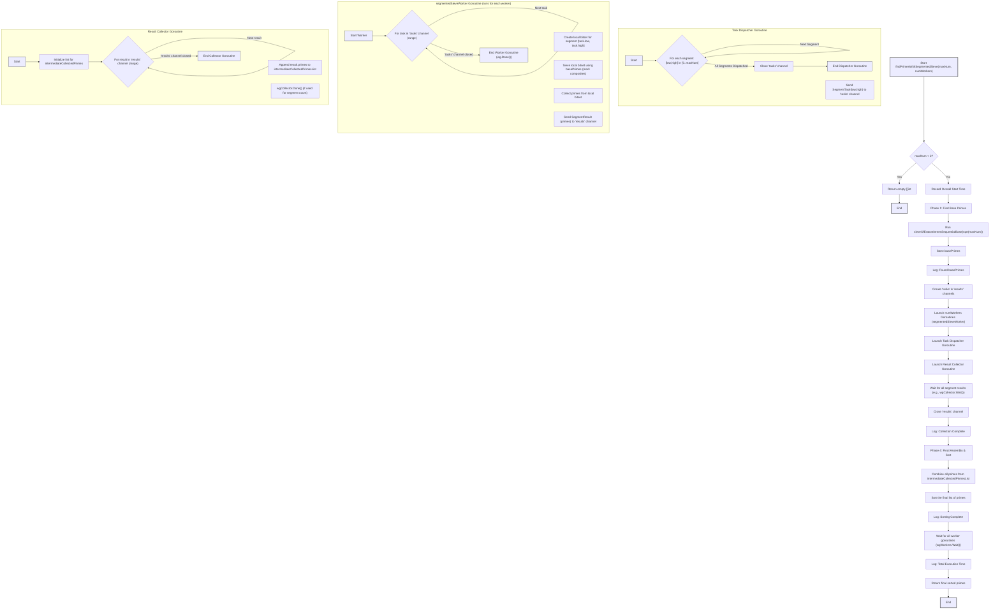

# Concurrent Prime Number Finder (Segmented Sieve)

### Code Coverage: 84.6%

A blazingly fast Go program that finds all prime numbers up to a specified limit (e.g., 200,000,000) using a parallelized Segmented Sieve of Eratosthenes algorithm. It leverages Goroutines for concurrent sieving of number segments, offering dynamic load balancing.

## Features

- Efficient prime number generation using a parallel Segmented Sieve of Eratosthenes.
- Uses a configurable number of worker Goroutines.
- The number range is divided into segments, which are processed in parallel by workers.
- Dynamic load balancing: workers pull segment tasks from a channel.
- Initial base primes (up to `sqrt(maxNum)`) are found using a fast optimized sequential sieve.
- Primes found in segments are combined and sorted.
- Progress logging for various stages of the sieve.

## Algorithm: Parallel Segmented Sieve of Eratosthenes

The program uses a parallelized Segmented Sieve of Eratosthenes. This approach is efficient for large `maxNum` by improving cache locality and enabling better load balancing.

1. **Phase 1: Base Prime Calculation (Sequential)**
    - A fast, optimized sequential Sieve of Eratosthenes is run to find all prime numbers up to `sqrt(maxNum)`. These are the `basePrimes` that will be used for sieving.
    - Example: If `maxNum` is 200,000,000, `sqrt(maxNum)` is ~14142. Finding primes up to 14142 is quick.

2. **Phase 2: Task Dispatch and Worker Setup**
    - The total number range `[0...maxNum]` is divided into smaller, manageable segments of a fixed `SegmentSizeInNumbers` (e.g., 524,288 numbers per segment).
    - A pool of worker Goroutines (e.g., 4 workers) is created.
    - A `tasks` channel is used to dispatch segment tasks (defined by a `low` and `high` boundary) to the workers.
    - A `results` channel is used by workers to send back the primes they find in their processed segments.

3. **Phase 3: Parallel Segment Sieving (Concurrent)**
    - Each worker Goroutine continuously pulls a `SegmentTask` from the `tasks` channel.
    - For its assigned segment `[low, high]`, the worker:
        - Creates a local boolean bitset (e.g., `segmentBitset`) representing only the numbers within its current segment. The size of this bitset is `SegmentSizeInNumbers / 8` bytes.
        - Iterates through the `basePrimes` (found in Phase 1). For each base prime `p`:
            - It calculates the first multiple of `p` that is greater than or equal to `low` and also greater than or equal to `p*p`.
            - It then marks all multiples of `p` within the `[low, high]` range in its `segmentBitset`.
        - This use of local bitsets for each segment improves CPU cache performance compared to a single large shared bitset.
    - After sieving its segment, the worker scans its `segmentBitset`, collects all unmarked numbers (which are primes in that segment's range), and sends them as a `SegmentResult` to the `results` channel.
    - Workers repeat this process until the `tasks` channel is closed (meaning all segments have been dispatched).

4. **Phase 4: Result Collection and Sorting (Sequential/Concurrent Collection)**
    - The main Goroutine (or a dedicated collector Goroutine) receives `SegmentResult` (lists of primes) from the `results` channel from all workers.
    - These lists of primes from different segments are aggregated into a single list.
    - Since segments can be processed out of order, the final aggregated list of primes is sorted to ensure they are in ascending order.
    - This sorted list is the final result.

This segmented approach provides good load balancing because faster workers or those processing segments with fewer primes will finish their tasks quicker and pick up new segments from the `tasks` channel.

## Progress Reporting

The program provides progress updates using the `log` package:

- Timestamps (including microseconds) are included in log messages.
- Key stages are logged: start, finding base primes, dispatching segment tasks, collection of segment results, sorting, and final summary.
- Total time taken for key phases and the overall operation is logged.

## System Architecture

```mermaid
graph TD
    Main["Main Goroutine"] -- "Starts & Orchestrates" --> SFS["findPrimesWithSegmentedSieve Function"]

    subgraph "findPrimesWithSegmentedSieve Function"
        P1["Phase 1: Sequential Sieve for Base Primes (up to sqrt(maxNum))"]
        Dispatcher["Task Dispatcher Goroutine"]
        Collector["Result Collector Goroutine"]
        P4["Phase 4: Final Sort & Aggregation"]
        TaskChan["tasks (chan SegmentTask)"]
        ResultChan["results (chan SegmentResult)"]
    end

    SFS -- "Executes" --> P1
    P1 -- "Returns basePrimes" --> SFS
    SFS -- "Launches" --> Dispatcher
    SFS -- "Launches Workers" --> WorkersPool
    SFS -- "Launches" --> Collector
    SFS -- "Performs" --> P4


    Dispatcher -- "Sends SegmentTask" --> TaskChan

    subgraph "Worker Pool (e.g., 4 Workers)"
        W1["Worker 1 Goroutine"]
        W2["Worker 2 Goroutine"]
        WN["...Worker N Goroutine"]
        LocalBitset1["Local Bitset (Segment)"]
        LocalBitset2["Local Bitset (Segment)"]
        LocalBitsetN["Local Bitset (Segment)"]

        W1 -- "Reads from" --> TaskChan
        W2 -- "Reads from" --> TaskChan
        WN -- "Reads from" --> TaskChan

        W1 -- "Uses basePrimes &" --> LocalBitset1
        W1 -- "Processes segment, finds primes" --> LocalBitset1
        LocalBitset1 -- "Primes" --> W1
        W1 -- "Sends SegmentResult" --> ResultChan

        W2 -- "Uses basePrimes &" --> LocalBitset2
        W2 -- "Processes segment, finds primes" --> LocalBitset2
        LocalBitset2 -- "Primes" --> W2
        W2 -- "Sends SegmentResult" --> ResultChan

        WN -- "Uses basePrimes &" --> LocalBitsetN
        WN -- "Processes segment, finds primes" --> LocalBitsetN
        LocalBitsetN -- "Primes" --> WN
        WN -- "Sends SegmentResult" --> ResultChan
    end

    Collector -- "Receives SegmentResult from" --> ResultChan
    Collector -- "Aggregates primes" --> P4
    P4 -- "Returns finalSortedPrimes" --> SFS

    Main -- "Receives finalSortedPrimes" --> Output["Final Primes List"]
    Log["Logging Output"]
    SFS -- "Logs to" --> Log
    Dispatcher -- "Logs to" --> Log
    Collector -- "Logs to" --> Log

    style SFS fill:#f9f,stroke:#333,stroke-width:2px
    style P1 fill:#lightgrey,stroke:#333
    style Dispatcher fill:#add8e6,stroke:#333
    style Collector fill:#add8e6,stroke:#333
    style P4 fill:#lightgrey,stroke:#333
    style TaskChan fill:#orange,stroke:#333
    style ResultChan fill:#orange,stroke:#333
    style W1 fill:#aqua,stroke:#333
    style W2 fill:#aqua,stroke:#333
    style WN fill:#aqua,stroke:#333
    style LocalBitset1 fill:#beige,stroke:#333
    style LocalBitset2 fill:#beige,stroke:#333
    style LocalBitsetN fill:#beige,stroke:#333
    style Output fill:#lightgreen,stroke:#333
    style Log fill:#grey,stroke:#333
```



## Algorithm Flowchart



## Requirements

- Go (version 1.18 or later recommended for generics, though this example doesn't strictly need them)

### Project Structure

```txt
.
├── go.mod        // Go module definition
├── go.sum        // Go module checksums
├── main.go       // Main application logic, segmented sieve implementation
├── main_test.go  // Unit tests for sieve logic
└── README.md     // This file
```

## Local Development, Running, Testing, and Benchmarking

```bash
go run .
```

**Results (will vary based on machine and `MaxNumberForSieveGlobal`):**

```txt
02:38:01.282794 Concurrent Prime Finder (Segmented Sieve Version) - Starting
02:38:01.283329 Finding primes up to 200000000 using 4 workers (Segmented Sieve method).
Segment size: 524288 numbers.
02:38:01.283865 Segmented Sieve: Finding base primes up to 14142
02:38:01.283865 Segmented Sieve: Found 1663 base primes in 0s
02:38:01.577385 Segmented Sieve: All 382 segment tasks dispatched in 293.5203ms
02:38:01.583896 Segmented Sieve: All segment results (382 segments) collected in 300.0319ms. Raw primes collected: 11078937
02:38:01.754615 Segmented Sieve: Primes combined and sorted in 170.7187ms. Total unique primes found: 11078937
02:38:01.754615 Segmented Sieve: Total time for findPrimesWithSegmentedSieve: 470.7506ms
02:38:01.754615 Found 11078937 prime numbers up to 200000000.
02:38:01.754615 Concurrent Prime Finder (Segmented Sieve Version) - Finished
```

### Running Tests

```bash
go test -v -cover ./...
```

**Test Output:**

```txt
=== RUN   TestSieveOfEratosthenesSequentialBase
=== RUN   TestSieveOfEratosthenesSequentialBase/primes_up_to_10
=== RUN   TestSieveOfEratosthenesSequentialBase/primes_up_to_20
=== RUN   TestSieveOfEratosthenesSequentialBase/primes_up_to_2
=== RUN   TestSieveOfEratosthenesSequentialBase/primes_up_to_1
=== RUN   TestSieveOfEratosthenesSequentialBase/primes_up_to_0
=== RUN   TestSieveOfEratosthenesSequentialBase/primes_up_to_30
=== RUN   TestSieveOfEratosthenesSequentialBase/primes_up_to_3
=== RUN   TestSieveOfEratosthenesSequentialBase/primes_up_to_4
--- PASS: TestSieveOfEratosthenesSequentialBase (0.00s)
    --- PASS: TestSieveOfEratosthenesSequentialBase/primes_up_to_10 (0.00s)
    --- PASS: TestSieveOfEratosthenesSequentialBase/primes_up_to_20 (0.00s)
    --- PASS: TestSieveOfEratosthenesSequentialBase/primes_up_to_2 (0.00s)
    --- PASS: TestSieveOfEratosthenesSequentialBase/primes_up_to_1 (0.00s)
    --- PASS: TestSieveOfEratosthenesSequentialBase/primes_up_to_0 (0.00s)
    --- PASS: TestSieveOfEratosthenesSequentialBase/primes_up_to_30 (0.00s)
    --- PASS: TestSieveOfEratosthenesSequentialBase/primes_up_to_3 (0.00s)
    --- PASS: TestSieveOfEratosthenesSequentialBase/primes_up_to_4 (0.00s)
=== RUN   TestFindPrimesWithSegmentedSieve_Orchestration
=== RUN   TestFindPrimesWithSegmentedSieve_Orchestration/sieve_up_to_10,_1_worker,_seg_5
=== RUN   TestFindPrimesWithSegmentedSieve_Orchestration/sieve_up_to_30,_4_workers,_seg_10
=== RUN   TestFindPrimesWithSegmentedSieve_Orchestration/sieve_up_to_50,_2_workers,_seg_20
=== RUN   TestFindPrimesWithSegmentedSieve_Orchestration/sieve_up_to_1_(no_primes),_4_workers,_seg_10
=== RUN   TestFindPrimesWithSegmentedSieve_Orchestration/sieve_up_to_100,_4_workers,_seg_25
=== RUN   TestFindPrimesWithSegmentedSieve_Orchestration/sieve_up_to_7,_2_workers,_seg_3_-_primes_only_in_base_up_to_sqrt(7)=2
--- PASS: TestFindPrimesWithSegmentedSieve_Orchestration (0.00s)
    --- PASS: TestFindPrimesWithSegmentedSieve_Orchestration/sieve_up_to_10,_1_worker,_seg_5 (0.00s)
    --- PASS: TestFindPrimesWithSegmentedSieve_Orchestration/sieve_up_to_30,_4_workers,_seg_10 (0.00s)
    --- PASS: TestFindPrimesWithSegmentedSieve_Orchestration/sieve_up_to_50,_2_workers,_seg_20 (0.00s)
    --- PASS: TestFindPrimesWithSegmentedSieve_Orchestration/sieve_up_to_1_(no_primes),_4_workers,_seg_10 (0.00s)
    --- PASS: TestFindPrimesWithSegmentedSieve_Orchestration/sieve_up_to_100,_4_workers,_seg_25 (0.00s)
    --- PASS: TestFindPrimesWithSegmentedSieve_Orchestration/sieve_up_to_7,_2_workers,_seg_3_-_primes_only_in_base_up_to_sqrt(7)=2 (0.00s)
PASS
coverage: 84.6% of statements
ok      go-parallel-prime-seeker        0.365s  coverage: 84.6% of statements
```

### Benchmarking

```bash
go test -bench=.
```

**Result:**

```txt
ok      go-parallel-prime-seeker        0.313s
```
